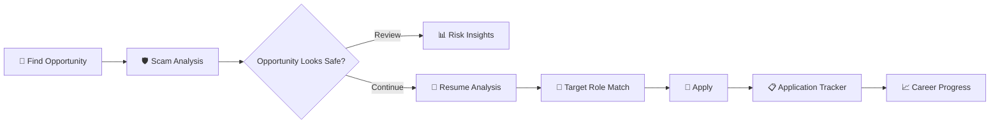

<div align="center">

# 🛡️ Student CareerShield

### **Your Career. Your Safety. Your Next Opportunity.**

AI-powered career safety and application management platform built for students and job seekers.

<br />

<a href="https://student-careershield.netlify.app/">
  
</a>
<a href="https://github.com/CodedByAryanSingh/student-careershield">
  
</a>

<br /><br />


<br /><br />


" alt="Student CareerShield" width="900" />

</div>

---

## ✨ What is Student CareerShield?

**Student CareerShield** is a full-stack career safety workspace designed to help students navigate the modern job and internship search more safely and efficiently.

Instead of treating career preparation as separate tools, CareerShield brings important parts of the workflow into one place:

```text
          🔎 FIND
             │
             ▼
      🛡️ CHECK SAFETY
             │
             ▼
       📄 ANALYZE RESUME
             │
             ▼
        🚀 APPLY
             │
             ▼
       📋 TRACK STATUS
             │
             ▼
        📈 IMPROVE
```

### The goal

> **Help students make better-informed career decisions while keeping their job search organized.**

---

## 🚀 Live Application

<div align="center">

### 🌐 Try CareerShield

<a href="https://student-careershield.netlify.app/">

</a>

<br /><br />

**No installation required — open the live application and explore the platform.**

</div>

---

# 🎯 Core Features

<table>
<tr>
<td width="50%">

### 🛡️ Internship Scam Detection

Analyze job and internship listings for suspicious signals and potential scam indicators.

**Includes:**

* 🔍 Listing analysis
* ⚠️ Risk indicators
* 🚨 Suspicious signal detection
* 💡 Safety-focused insights

</td>

<td width="50%">

### 📄 AI Resume Analysis

Evaluate a resume against a target role and identify areas that could be improved.

**Includes:**

* 📊 Resume scoring
* 🎯 Role matching
* 🔑 Skill & keyword analysis
* 💡 Improvement suggestions

</td>
</tr>

<tr>
<td width="50%">

### 📋 Application Tracker

Keep every application organized inside a persistent career pipeline.

**Includes:**

* ➕ Add applications
* 🔄 Update status
* 🗂️ Track opportunities
* 🗑️ Remove applications

</td>

<td width="50%">

### 📊 Career Workspace

Bring safety checks, resume analysis, and applications together in one workflow.

**Designed for:**

* 🎓 Students
* 💼 Job seekers
* 🧑‍💻 Internship applicants
* 🚀 Early-career developers

</td>
</tr>
</table>

---

# 🖥️ Product Preview

## Overview

<div align="center">


/>

</div>

> A centralized workspace for navigating the career-search process.

---

## 🛡️ Scam Detection

<div align="center">


</div>

> Analyze an opportunity before investing time, personal information, or effort into the application.

---

## 📄 Resume Analysis

<div align="center">


</div>

> Understand how your resume aligns with a target role and where it can be improved.

---

## 📋 Application Tracking

<div align="center">


</div>

> Keep applications organized instead of managing opportunities across scattered notes and spreadsheets.

---

# ⚡ How It Works



---

# 🧠 Platform Architecture

```text
┌──────────────────────────────────────────────┐
│                 FRONTEND                     │
│                                              │
│     React + Vite + Tailwind CSS              │
│                                              │
│  Dashboard │ Scam Analysis │ Resume │ Apps   │
└──────────────────────┬───────────────────────┘
                       │
                       │ REST API
                       ▼
┌──────────────────────────────────────────────┐
│                  BACKEND                     │
│                                              │
│             Node.js + Express                │
│                                              │
│  /scam/analyze                               │
│  /resume/analyze                             │
│  /applications                              │
│  /health                                     │
└──────────────────────┬───────────────────────┘
                       │
                       ▼
┌──────────────────────────────────────────────┐
│                 DATA LAYER                   │
│                                              │
│          Persistent application data         │
│                                              │
└──────────────────────────────────────────────┘
```

---

# 🛠️ Tech Stack

| Layer                | Technology     |
| -------------------- | -------------- |
| 🎨 Frontend          | React          |
| ⚡ Build Tool         | Vite           |
| 💅 Styling           | Tailwind CSS   |
| 🟢 Runtime           | Node.js 20+    |
| 🚂 Backend           | Express.js     |
| 🔌 API               | REST           |
| 🔐 Authentication    | JWT + bcryptjs |
| 🗄️ Database Support | PostgreSQL     |
| 🚀 Deployment        | Netlify        |
| 📦 Package Manager   | npm            |
| 🔧 Version Control   | Git + GitHub   |

The repository's package configuration currently requires **Node.js 20 or newer** and includes `bcryptjs`, `jsonwebtoken`, and `pg` dependencies.

---

# 🔌 API

CareerShield exposes a lightweight REST API for its core functionality.

|  Method  | Endpoint                | Description            |
| :------: | ----------------------- | ---------------------- |
|   `GET`  | `/api/health`           | Check API status       |
|  `POST`  | `/api/scam/analyze`     | Analyze an opportunity |
|  `POST`  | `/api/resume/analyze`   | Analyze a resume       |
|   `GET`  | `/api/applications`     | Retrieve applications  |
|  `POST`  | `/api/applications`     | Create application     |
|  `PATCH` | `/api/applications/:id` | Update application     |
| `DELETE` | `/api/applications/:id` | Delete application     |

---

# 📁 Project Structure

```text
student-careershield/
│
├── client/
│   ├── src/
│   ├── public/
│   ├── package.json
│   └── ...
│
├── server/
│   ├── index.mjs
│   ├── data/
│   └── ...
│
├── scripts/
│   └── dev.mjs
│
├── package.json
├── package-lock.json
├── LICENSE
├── .gitignore
└── README.md
```

---

# 💻 Run Locally

## Prerequisites

Make sure you have:

* **Node.js 20+**
* **npm**
* PostgreSQL if using the database configuration

---

## 1️⃣ Clone

```bash
git clone https://github.com/CodedByAryanSingh/student-careershield.git

cd student-careershield
```

---

## 2️⃣ Install Dependencies

```bash
npm install
```

---

## 3️⃣ Start Development

```bash
npm run dev
```

The development setup runs the React application on:

```text
http://localhost:5173
```

and proxies API traffic to:

```text
http://localhost:8787
```

---

## 4️⃣ Production Build

```bash
npm run build
```

Then start the production server:

```bash
npm start
```

Production server:

```text
http://localhost:8787
```

These commands and development ports correspond to the repository's current README and package scripts.

---

# 🔐 Security

CareerShield is designed with security in mind.

### Never commit:

```text
.env
API keys
Database credentials
JWT secrets
Private credentials
```

Use environment variables for sensitive configuration and keep secrets outside the repository.

---

# 🗺️ Roadmap

### ✅ Completed

* [x] Career safety workspace
* [x] Internship scam analysis
* [x] Resume analysis
* [x] Application tracking
* [x] REST API
* [x] Persistent application workflow
* [x] React frontend
* [x] Express backend
* [x] Production deployment

### 🔨 In Development

* [ ] More advanced scam-detection signals
* [ ] Improved resume ↔ job matching
* [ ] Application analytics
* [ ] Career insights
* [ ] Notification & reminder system

### 🔭 Future

* [ ] Browser extension
* [ ] Saved job opportunities
* [ ] Automated job-safety checks
* [ ] Advanced AI career assistant
* [ ] Email integration
* [ ] Personalized career recommendations

---

# 📈 Project Vision

CareerShield is not intended to be just another job tracker.

The long-term vision is a **personal career intelligence layer** that sits between a student and the modern job market.

```text
             OPPORTUNITIES
                   │
                   ▼
          ┌─────────────────┐
          │  CAREERSHIELD   │
          └────────┬────────┘
                   │
       ┌───────────┼───────────┐
       ▼           ▼           ▼
   🛡️ SAFETY    📄 RESUME    📋 TRACKING
       │           │           │
       └───────────┼───────────┘
                   ▼
             🎯 BETTER
          CAREER DECISIONS
```

---

# 🌟 Why I Built This

Students often use multiple disconnected tools during a job search:

**Job boards → Notes → Resume tools → Spreadsheets → Emails → More tabs**

CareerShield explores a different approach:

> **One focused workspace for career safety and application management.**

The project was built as a practical full-stack application to explore how **AI-assisted analysis, web development, APIs, and career workflows** can come together in one product.

---

# 👨‍💻 Developer

<div align="center">

### Aryan Singh

**B.Tech Computer Science Engineering**

Full-Stack Developer • AI Enthusiast • Software Engineering

<br />

<a href="https://github.com/CodedByAryanSingh">

</a>

</div>

---

# 🤝 Contributing

Contributions, suggestions, and improvements are welcome.

```bash
# Fork the repository

# Create a feature branch
git checkout -b feature/your-feature

# Commit your changes
git commit -m "feat: add your feature"

# Push
git push origin feature/your-feature

# Open a Pull Request
```

---

# 📜 License

This project is licensed under the **MIT License**.

See [`LICENSE`](./LICENSE) for more information.

---

<div align="center">

## 🛡️ CareerShield

### **Stay Alert. Apply Smarter. Build Your Career.**

<br />

⭐ **If you find this project interesting, consider starring the repository.**

<br />


</div>

